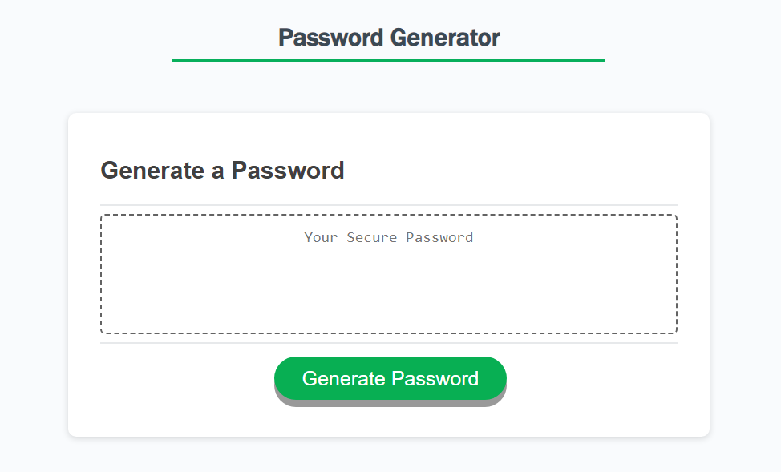
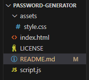

# Password Generator

## Description

This is a password generator. Input whether the user wants lower case, upper case, numbers, special characters and the length of password needed using prompts. With that information, and using a JavaScript algorithm, the password generator creates a random 'string' that can be used as a password. Highlight this password and copy it to be used in other applications.

## Installation

Click the link here for the deployed website: https://embleem.github.io/password-generator/

## Usage

Clone the repo to edit the code. 

Here is the file structure:

## Credits

With credits to https://github.com/jwilferd10/
Looked at how he did his JavaScript for a similar project, thank you so much for the help! Was invaluable.

## License

MIT license.
